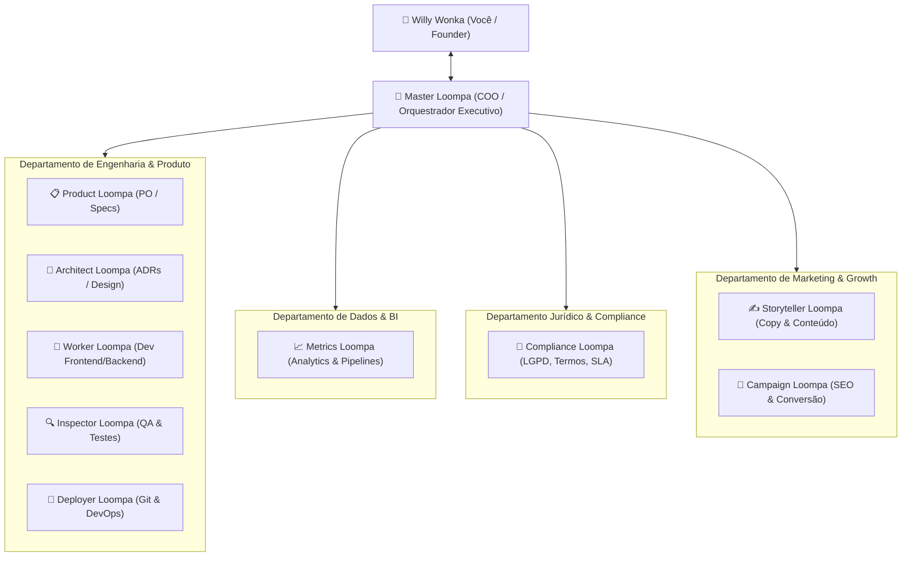
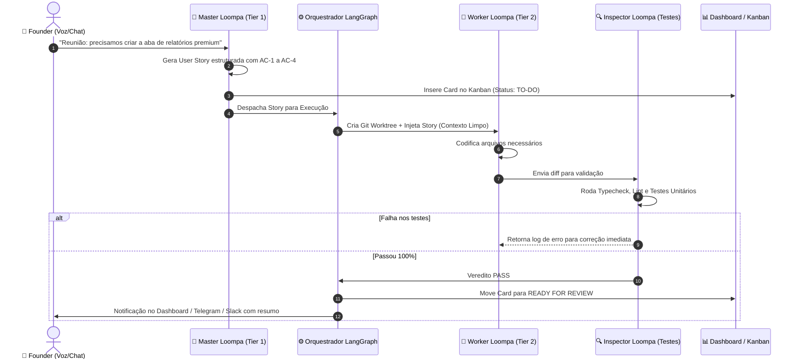

# 🏭 PROJECT BRIEF: Oompa Loompa LTDA
> **A Fábrica Autônoma de Software e Operações Multi-Agente com Governança Ágil**

---

## 📌 1. Visão Executiva & Conceito

**Oompa Loompa LTDA** é um framework e orquestrador de "empresa virtual de IA", projetado para operar como uma organização real, hiperespecializada e autônoma. 

Inspirado na disciplina, divisão de trabalho e execução incansável dos lendários trabalhadores da Fantástica Fábrica, o sistema substitui o paradigma ultrapassado do *"chat monolítico de IA"* (que sofre com explosão de contexto, alucinações e queima descontrolada de tokens) por uma **hierarquia orquestrada de agentes com contexto efêmero, matriz de modelos por custo/competência, governança ágil e reuniões executivas por voz**.

O pacote será inicialmente desenvolvido utilizando **AIOX puro** em um repositório próprio, tornando-se um núcleo modular e reutilizável (*plug-and-play*) para qualquer novo projeto de software, SaaS ou operação digital.

---

## 🎯 2. Dores que a Oompa Loompa LTDA Resolve

| Dor Atual no Desenvolvimento com Agentes | Como a Oompa Loompa LTDA Soluciona |
| :--- | :--- |
| **Explosão de Contexto & Custo Alto** (chats de 50+ turnos custando 150k+ tokens/envio). | **Contexto Zero / Efêmero**: Cada tarefa abre uma sessão isolada com 0 tokens de histórico anterior e morre após o commit. |
| **Gargalo Serial** (um único agente tentando fazer tudo, um passo de cada vez). | **Trabalho Paralelo com Git Worktrees**: Várias histórias e tarefas avançam simultaneamente sem conflito de branch ou arquivos. |
| **Alucinações em Código Brownfield** (agentes refatorando o que não devem). | **Quality Gates Estritos**: Nenhuma linha entra em staging/produção sem passar pela inspeção de linters, testes e revisão sênior. |
| **Uso Ineficiente de Modelos Caros** (usar Claude 3.7 Sonnet para rodar um linter ou commit). | **Matriz de Modelos Inteligente**: Modelos Tier 1 para estratégia e arquitetura; Tier 2 e 3 (Flash/Haiku/Scripts) para execução mecânica. |
| **Falta de Visibilidade Executiva** (o founder fica perdido lendo logs de terminal). | **Sala de Reuniões por Voz + Dashboard/Kanban** com crachás de status em tempo real dos trabalhadores da fábrica. |

---

## 🏢 3. Organização Departamental da Empresa

A fábrica é dividida em departamentos independentes, onde cada agente (um *Loompa Especialista*) possui escopo delimitado, ferramentas dedicadas e regras de atuação.

### Detalhamento dos Cargos e Atribuições:

1. **Master Loompa (Diretoria / COO):**
   * Interface principal com você (reuniões por voz/chat).
   * Recebe objetivos de negócio de alto nível, decompõe em demandas departamentais e cobra relatórios de progresso.
2. **Product Loompa (PO):**
   * Escreve e mantém os PRDs, Épicos e User Stories com critérios de aceitação rigorosos (BDD/Gherkin).
   * Prioriza o Backlog e gerencia o Kanban.
3. **Architect Loompa (Engenheiro Chefe):**
   * Desenha diagramas de arquitetura, contratos de API, schemas de banco e ADRs (*Architecture Decision Records*).
4. **Worker Loompas (Desenvolvedores):**
   * Executores rápidos. Pegam uma story fechada e implementam os arquivos estritamente necessários em um *Git Worktree* isolado.
5. **Inspector Loompa (QA):**
   * Valida acceptance criteria, roda testes unitários, testes de regressão e checa cobertura de código. Veredito binário: *PASS* ou *FAIL*.
6. **Deployer Loompa (DevOps Jr & Sr):**
   * Jr: Formatação de commits semânticos, limpeza de git, typecheck e linting.
   * Sr: Criação de PRs, merge e deploy automatizado para ambientes de staging/produção.
7. **Compliance Loompa (Jurídico):**
   * Analisa riscos legais, adequação a leis (ex: LGPD, GDPR), políticas de privacidade, termos de uso e normas regulatórias setoriais.
8. **Metrics Loompa (Dados & Analytics):**
   * Cuida de modelagem de dados, queries analíticas (BigQuery, PostgreSQL), dashboards de métricas de produto e telemetria.
9. **Storyteller & Growth Loompa (Marketing):**
   * Redação de copy para landing pages, e-mails transacionais e de retenção, documentação voltada ao usuário final e SEO.

---

## 🧠 4. Matriz Inteligente de Modelos (Smart Tiering)

A empresa aloca o modelo certo para a complexidade exata da tarefa, garantindo redução de até **80% no custo de tokens**:

| Tier | Modelos Recomendados | Onde é Alocado | Função na Fábrica |
| :--- | :--- | :--- | :--- |
| **Tier 1 (Olimpo / Raciocínio Profundo)** | Claude 3.7 Sonnet / Gemini 2.0 Pro Ultra | Master Loompa, Architect Loompa, Compliance Loompa, Code Review Final | Pensamento estratégico, reuniões com o founder, redação de contratos de API e aprovação final de deploys. |
| **Tier 2 (Executores de Alta Performance)** | Gemini 2.0 Flash / Claude 3.5 Haiku / DeepSeek V3 | Worker Loompas (Devs), Copywriter Loompa, Metrics Loompa | Implementação de código focado, escrita de testes unitários, queries SQL e redação de conteúdo. |
| **Tier 3 (Operários Determinísticos)** | Gemini Flash-Lite / Scripts Locais / CLI | Deployer Jr, Linters, Formatadores de Git, Typechecker | Execução de scripts mecânicos (`eslint`, `tsc`, `git commit`), monitoramento de pipelines e checagem de regras. |

---

## ⚙️ 5. Arquitetura Técnica do Sistema

### Pilares de Engenharia:
1. **LangGraph / Máquina de Estados:**
   * Estados bem definidos (`DRAFTING_SPEC`, `READY_FOR_DEV`, `IN_DEV`, `IN_QA`, `BLOCKED`, `DONE`).
   * Suporte a *Human-in-the-Loop (HITL)*: o grafo sabe pausar e pedir autorização humana antes de ações irreversíveis (deploys, migrations, pagamentos).
2. **Isolamento via Git Worktrees:**
   * Cada Worker Loompa trabalha em uma pasta de trabalho isolada (`.loompa/worktrees/story-123`). Dois agentes nunca colidem no mesmo diretório em tempo real.
3. **Memória Vetorial & RAG (AgentDB / Embeddings):**
   * Banco vetorial local leve (HNSW / SQLite) indexando as decisões da empresa, a base de código e os padrões arquiteturais. O agente só puxa o que precisa para a sua tarefa específica.
4. **Interface Executiva:**
   * **Sala de Reuniões:** Suporte a ditado por voz via Whisper local (Superwhisper / MacWhisper) e síntese de áudio (TTS).
   * **Painel da Fábrica (Web Dashboard):** Visualização em Kanban das demandas em tempo real e crachá de telemetria dos agentes (status, tokens consumidos, custos acumulados).

---

## 🗺️ 6. Roadmap de Construção (Bootstrapping com AIOX)

O projeto será criado em um repositório isolado (`oompa-loompa-core`), utilizando a metodologia do **AIOX** para o seu próprio nascimento:

* [ ] **Fase 1: Fundação & Contratos (O Protocolo Loompa)**
  * Criação do repositório `oompa-loompa-core`.
  * Definição dos schemas JSON/YAML dos agentes (cargos, permissões, ferramentas permitidas, modelo atribuído).
  * Criação da persona do `Master Loompa` e padronização do formato de `Loompa Story`.
* [ ] **Fase 2: Motor de Orquestração (O Grafo Básico)**
  * Implementação da máquina de estados com **LangGraph** (Python ou TypeScript).
  * Automação de abertura e encerramento de sessões com contexto limpo.
  * Criação do mecanismo de *Git Worktrees* automatizado para workers de código.
* [ ] **Fase 3: Quality Gates & Especialistas Não-Dev**
  * Integração do Inspector Loompa (execução determinística de testes e linters).
  * Adição dos módulos de *Legal Loompa* (revisão de conformidade) e *Growth Loompa* (geração de copy).
* [ ] **Fase 4: Dashboard da Fábrica & Sala de Reunião**
  * Criação do Dashboard web (Kanban + Status dos Agentes + Consumo de Tokens).
  * Integração com áudio/voz para reuniões executivas com o Master Loompa.
  * Empacotamento do Oompa Loompa LTDA como CLI / NPM / Pip package para ser plugado em qualquer projeto (incluindo o FOCA SaaS).

---

*Documento gerado como base de especificação para o novo repositório `oompa-loompa-core`.*
