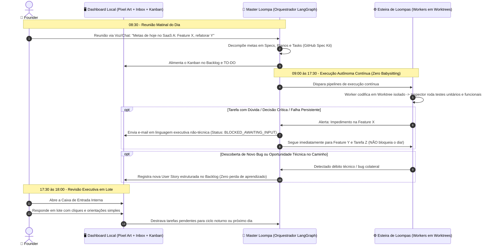
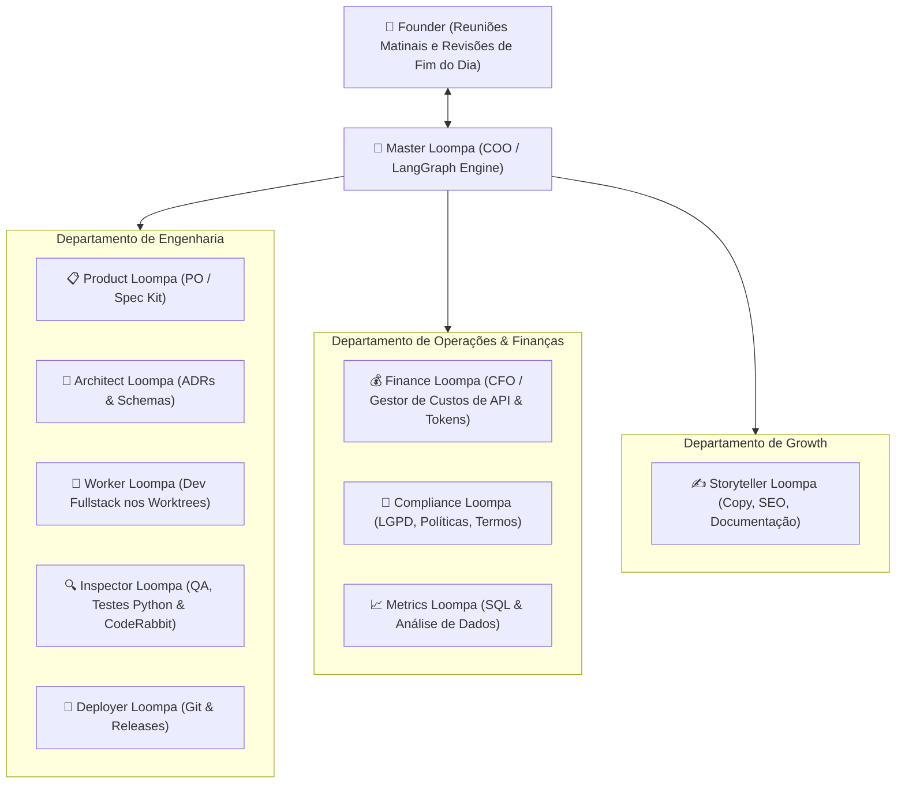

# 🏭 PROJECT BRIEF: Loompa LTDA
> **A Fábrica Autônoma de Software e Operações Multi-Agente com Governança Assíncrona, Execução em Lote, Onboarding Adaptativo e Memória Contínua**

---

## 📌 1. Visão Executiva & Conceito

O **Loompa LTDA** é uma infraestrutura, CLI e orquestrador de "empresas virtuais de software". O sistema foi desenhado para ser empacotado como um motor modular plug-and-play, permitindo que um único Founder crie e gerencie múltiplas fábricas (subsidiárias autônomas), onde cada mini-empresa é responsável pelo ciclo de vida completo de um produto, microsserviço ou SaaS específico.

O sistema adota o paradigma da **Autonomia Assíncrona Diária (Zero Babysitting)**:

* **Setup em Comando Único:** O sistema se conecta a qualquer repositório — seja ele um projeto novo (Greenfield) ou uma base de código legada complexa (Brownfield) — e realiza um escaneamento automático para calibrar suas regras e ponto de partida.
* **Kickoff Matinal:** O Founder alinha as metas do dia em uma única reunião executiva matinal (por voz ou texto) no painel de controle.
* **Execução Contínua em Lote:** O orquestrador despacha as tarefas em paralelo/sequência através de Git Worktrees isolados. Tarefas com dúvidas entram em pausa isolada, enquanto a esteira segue em todas as demais demandas sem interrupção.
* **Revisão de Fim de Dia:** O Founder acessa a interface no fim da jornada para destravar decisões acumuladas na Caixa de Entrada e inspecionar entregas prontas para staging/produção.

---

## 🚀 2. Setup Descomplicado, Multi-Fábricas & Onboarding Adaptativo

O ecossistema opera como um pacote executável simples (distribuído via `pip install loompa-core` ou `uvx loompa`), capaz de gerenciar múltiplos produtos simultaneamente:

```text
[ Founder Terminal / Hub Central ]
                │
    ┌───────────┴───────────┐
    ▼                       ▼
┌──────────────────┐    ┌──────────────────┐
│  Fábrica SaaS A  │    │  Fábrica API B   │
│  (Brownfield)    │    │  (Greenfield)    │
│  .loompa/        │    │  .loompa/        │
└──────────────────┘    └──────────────────┘
```

### A. O Comando de Inicialização (`loompa init`)

Ao rodar `loompa init` na raiz de qualquer projeto, o orquestrador identifica o estágio do repositório e dispara o fluxo de calibração correspondente:

#### Cenário 1: Projeto Greenfield (Do Zero)
* O agente identifica o diretório vazio ou sem histórico Git.
* Inicia o repositório Git, configura branches de proteção e cria o diretório `.loompa/`.
* Questiona o Founder sobre a stack desejada (ex.: FastAPI + React + PostgreSQL) e gera o esqueleto inicial com `constitution.md` limpa e pronta para o primeiro épico.

#### Cenário 2: Projeto Brownfield (Código Existente)
* **Auditoria de Stack & Dependências:** O motor inspeciona arquivos-chave (`package.json`, `pyproject.toml`, `Dockerfile`, migrations, schemas de banco).
* **Varredura de Padrões & Testes:** Mapeia a biblioteca de testes em uso (`pytest`, `jest`), linters configurados e taxa de cobertura atual.
* **Engenharia Reversa da Arquitetura:** O Architect Loompa sintetiza a arquitetura existente e redige uma proposta preliminar de `constitution.md` (registrando padrões observados para proibir que futuros agentes inventem bibliotecas alienígenas).
* **Indexação na Base de Conhecimento:** Código, esquemas e documentações legadas são indexados na memória de consulta do projeto.
* **Relatório de Onboarding:** Na primeira reunião matinal, o Master Loompa apresenta um sumário não-técnico do que encontrou no projeto legado para validação rápida do Founder.

### B. Gestão Multi-Fábricas no Dashboard Localhost

A interface web permite alternar dinamicamente entre múltiplos produtos. Cada produto possui seu próprio diretório `.loompa/` contendo:
* Histórico de decisões locais e custos acumulados em USD.
* Worktrees isolados e tarefas em andamento.
* Banco de memória local SQLite e índice vetorial próprio.

---

## ☀️ 3. A Rotina Operacional do Founder (O Ciclo Manhã / Fim do Dia)

O sistema foi desenhado especificamente para respeitar o foco cognitivo do fundador:



### Regras Inegociáveis da Rotina:
* **Zero Bloqueio em Cascata:** Se uma tarefa empacar por necessidade de teste manual, aprovação de layout ou dúvida arquitetural, ela é colocada em standby isolado. O orquestrador jamais interrompe as outras frentes de trabalho.
* **Comunicação Executiva Não-Técnica (Regra de Ouro):** Todo e qualquer e-mail, notificação ou pedido de decisão direcionado ao Founder deve ser redigido em linguagem simples, direta e orientada a negócios/produto. Jargões de código puro, stack traces e erros crípticos de terminal são estritamente filtrados pelo Master Loompa, que traduz o problema em: **Contexto Simples**, **Impacto no Negócio** e **Opções Recomendadas de Resposta**.
* **Decisões em Lote:** O Founder destrava 5 a 10 decisões em poucos minutos ao fim da tarde, mantendo o dia livre para suas atividades estratégicas.

---

## 🎯 4. Dores Resolvidas pela Loompa LTDA

| Dor Crítica do Desenvolvimento com IA | Como a Loompa LTDA Resolve |
| :--- | :--- |
| **Interrupções Constantes & Micromanagement** (desenvolvedor vira escravo de responder prompts a cada minuto). | **Ciclo Manhã/Noite Assíncrono:** O Founder despacha ordens pela manhã e só revisa entregas e a caixa de entrada no final do expediente. |
| **Bloqueio Serial** (agente para todo o pipeline porque tem uma dúvida pontual). | **Isolamento de Estado:** O item bloqueado vira um e-mail interno pendente; as outras histórias continuam sendo desenvolvidas em paralelo. |
| **Explosão de Contexto & Custo Alto** (chats longos acumulando tokens inúteis). | **Contexto Zero / Efêmero:** Cada sub-tarefa roda em uma sessão isolada via CLI enxuta, encerrando logo após a conclusão do commit/PR. |
| **Perda de Aprendizados e Débitos Técnicos Ocultos** (agente vê um erro e ignora). | **Loop Kaizen de Aprendizado Contínuo:** Qualquer anomalia, bug ou melhoria detectada vira documentação ou nova User Story no backlog automaticamente. |
| **Alucinações e Regressões em Código Brownfield** (IA alterando arquivos legados indevidamente). | **GitHub Spec Kit + Onboarding de Legado:** `constitution.md` blindada, mapeamento prévio de arquitetura e suíte rigorosa de testes em Python. |
| **Poluição de Terminal** (agente roda comando e cospe 4.000 linhas de logs no contexto). | **Paradigma ACI (SWE-agent):** Ferramentas CLI intermediárias que filtram saídas de linters e testes, retornando apenas diffs e linhas de erro cirúrgicas. |

---

## 🏢 5. Organização Departamental da Empresa

A fábrica é dividida em departamentos funcionais com papéis enxutos, utilizando escalonamento dinâmico de modelos (evitando o inchaço de dezenas de personas separadas para júnior, pleno e sênior):



### Detalhamento dos Cargos e Atribuições:

1. **Master Loompa (COO / Orquestrador Geral):**
   * Conduz a reunião matinal de alinhamento com o Founder.
   * Converte objetivos de negócio em épicos e despacha a execução sequencial/paralela no grafo.
   * Redige os e-mails da Caixa de Entrada do Founder em linguagem executiva simples e sem termos técnicos indecifráveis.
2. **Product Loompa (PO):**
   * Opera o protocolo do GitHub Spec Kit: redige `spec.md`, critérios de aceitação em BDD e decompõe funcionalidades em `tasks.md`.
3. **Architect Loompa (Engenharia de Soluções):**
   * Escreve `plan.md`, define contratos OpenAPI, schemas de banco de dados e registra regras invioláveis em `constitution.md`. Conduz o onboarding de projetos Brownfield.
4. **Worker Loompa (Desenvolvedor Fullstack):**
   * Executor de implementação cirúrgica dentro de um Git Worktree isolado. Recebe o checklist de `tasks.md` e codifica estritamente o escopo acordado.
5. **Inspector Loompa (QA, Testes Funcionais & Auditoria):**
   * Roda linters, checagens de tipos e a suíte completa de testes em Python (`pytest`, testes funcionais de endpoints e validações de critérios de aceitação).
   * Integra-se com revisores automatizados de código (como CodeRabbit em repositórios abertos/free tiers) para emitir pareceres binários: **PASS** ou **FAIL**.
6. **Deployer Loompa (DevOps & Releases):**
   * Padroniza commits semânticos, resolve merges sem conflito e prepara Pull Requests com sumário de alterações pronto para o Founder inspecionar.
7. **Finance Loompa (CFO / Gestor de Custos & Eficiência de Tokens):**
   * Monitora em tempo real o consumo de tokens de entrada/saída de cada agente e ferramenta.
   * Calcula o custo exato em USD por User Story e por ciclo diário.
   * Emite alertas imediatos caso a esteira se aproxime do teto estipulado para o mês ($10 a $30 USD) e sugere otimizações no tamanho dos prompts.
8. **Compliance, Metrics & Storyteller Loompas:**
   * Agentes de suporte sob demanda para conformidade regulatória (LGPD), queries analíticas de dados e redação de copy para produtos digitais.

---

## 🧠 6. Matriz Inteligente de Modelos & Escalação Dinâmica

Para manter o custo mensal entre **$10 e $30 USD** com padrão profissional de código, a empresa utiliza uma matriz escalonável baseada em consumo real e tiers gratuitos:

| Tier | Modelos Empregados | Onde é Alocado | Estratégia de Consumo |
| :--- | :--- | :--- | :--- |
| **Tier 1 (Alta Cognição & Raciocínio Profundo)** | DeepSeek-R1 / Gemini 2.0 Pro (Free Tier AI Studio) / Claude 3.7 Sonnet (sob demanda crítica de arquitetura) | Master Loompa, Architect Loompa e Escalação de Correção de Bugs | Análise de arquitetura na reunião matinal e resolução de problemas que falharam repetidamente no Tier 2. Custo ultra reduzido via DeepSeek API. |
| **Tier 2 (Executores de Alta Performance)** | DeepSeek-V3 / Gemini 2.0 Flash (Free Tier AI Studio) | Worker Loompas (Dev), Inspector Loompa (QA), Copy, SQL e Finance Loompa | Escrita de código, criação de testes unitários e tarefas rotineiras. Custo de centavos por milhão de tokens. |
| **Tier 3 (Operários Determinísticos)** | Scripts Python locais, Linters CLI (`ruff`, `eslint`), Git nativo | Deployer Jr, filtros de log ACI e checagens estáticas | Custo Zero ($0.00). Nenhuma chamada de LLM para tarefas que compiladores e formatadores já resolvem. |

### Mecanismo de Escalação Dinâmica (LangGraph):

Em vez de criar personas separadas de Júnior, Pleno e Sênior:
* Toda tarefa de código começa sendo implementada pelo Worker Loompa em **Tier 2** (DeepSeek-V3).
* O Inspector Loompa executa os testes e checagens em ambiente isolado.
* Se os testes falharem:
  * **1ª Falha:** O erro é filtrado via ACI e devolvido ao Tier 2 para correção pontual.
  * **2ª Falha Consecutiva:** O LangGraph dispara a escalação automática: o contexto filtrado do erro é transferido para um modelo Tier 1 de raciocínio profundo (DeepSeek-R1) para auditar e corrigir o código.
  * **Persistência da Falha:** O grafo isola a tarefa como `BLOCKED_AWAITING_INPUT`, notifica a Caixa de Entrada do Founder em linguagem executiva amigável e avança imediatamente para as outras tarefas da fila.

---

## 🔄 7. Autoaprendizado Contínuo & Preservação de Conhecimento (Loop Kaizen)

Para garantir que a fábrica de software aprenda e evolua a cada linha de código sem perda de inteligência:

* **Captura Automática de Descobertas:** Se durante a execução de uma tarefa um Worker ou Inspector Loompa descobrir um bug colateral, uma inconsistência de arquitetura legada ou uma oportunidade de otimização:
  * O agente não deve tentar resolver fora do escopo (evitando desvio de foco e quebra de testes).
  * O orquestrador registra o achado em um arquivo central de aprendizado (`.loompa/learnings.md`) e cria automaticamente um card estruturado de melhoria técnica na coluna Backlog do Kanban.
* **Atualização de Diretrizes (`constitution.md`):** Se um erro for corrigido após escalação para o Tier 1, a lição aprendida (ex.: *"Sempre utilizar transações atômicas ao salvar itens da tabela X"*) é adicionada pelo Architect Loompa nas regras da constituição do projeto, blindando os próximos agentes contra o mesmo erro.
* **Relatório Diário de Kaizen:** Ao final do dia, o Finance Loompa e o Master Loompa incluem um sumário simples das anomalias descobertas e das novas oportunidades catalogadas no backlog para avaliação do Founder.

---

## ⚙️ 8. Engenharia do Sistema: Memória Híbrida (RAG Local), Worktrees & Quality Gates

### A. Memória Organizacional Híbrida (RAG Local + Busca Léxica)

O sistema não injeta código-fonte cru em banco vetorial puro (o que causa perda de sintaxe e alucinações de tipos). Em vez disso, implementa uma estratégia de duas camadas de memória:

1. **Camada Estrutural & Léxica (Para Código-Fonte):**
   * Ferramentas baseadas em AST (Abstract Syntax Trees), ripgrep e busca exata de símbolos via CLI do ACI.
   * Garante 100% de fidelidade sintática sem alucinar nomes de variáveis ou assinaturas de funções.
2. **Camada Vetorial & Semântica (Para Memória Organizacional e Decisões - RAG Local):**
   * Base local embutida (SQLite com extensão vetorial ou ChromaDB/LanceDB local).
   * Embeddings gerados localmente via modelos compactos (como `all-MiniLM-L6-v2` via ONNX/FastEmbed) — Custo Zero ($0.00) e execução offline.
   * **O que é indexado:** O histórico de ADRs (Architecture Decision Records), a `constitution.md`, o repositório de lições aprendidas (`learnings.md`), documentações de regras de negócio e resoluções passadas de bugs.
   * **Como é consumido:** Quando o Product Loompa ou Worker Loompa recebe uma nova tarefa, ele faz uma consulta semântica rápida nessa memória para recuperar precedentes: *"Como tratamos autenticação de tokens no passado?"* ou *"Quais foram os erros já cometidos na integração com o gateway de pagamento?"*.

### B. Observatório & Adoção de Práticas do IOX/AIOX

* **Auditoria de Código via CodeRabbit:** Integração de Webhook com a versão gratuita do CodeRabbit (para repositórios públicos/open source) como revisor imparcial adicional antes de liberar os PRs.
* **Testes Abrangentes em Python:** Toda funcionalidade desenvolvida deve incluir suíte de testes com `pytest`, cobrindo 100% dos critérios de aceitação (BDD) descritos na `spec.md` e testando cenários felizes, exceções e validação de contratos de API.
* **Critérios de Aceitação Binários (PASS/FAIL):** Reprovação estrita caso haja violação de qualquer critério acordado na especificação.

### C. Orquestração de Estados com LangGraph

* **Grafos Assíncronos & Branching:** Cada história de usuário roda em um sub-grafo isolado. O bloqueio de um nó de execução não congela os outros ramos ativos.
* **Pontos de Checagem (Checkpoints):** Uso de banco local SQLite para persistência total do estado (`interrupt`/`resume`). O sistema pode ser pausado e retomado sem perda de progresso.

### D. Isolamento via Git Worktrees

* Cada tarefa em desenvolvimento opera em um diretório temporário isolado (`.loompa/worktrees/story-XYZ`).
* Vários Loompas codificam simultaneamente sem risco de colisão de arquivos ou conflitos no diretório raiz do projeto.

### E. Protocolo GitHub Spec Kit

Nenhuma linha de código é gerada sem a tríade de artefatos estruturados em Markdown:
* `constitution.md`: Princípios inegociáveis do projeto (arquitetura, convenções, bibliotecas permitidas).
* `spec.md`: Regras de negócio e critérios de aceitação funcionais.
* `plan.md` & `tasks.md`: Plano de execução técnica e checklist de tarefas atômicas.

### F. Paradigma ACI (SWE-agent Interface)

Os agentes não recebem o terminal bash tradicional. Ferramentas intermediárias filtram as saídas:
* Leitura de arquivos sempre paginada e delimitada por linhas.
* Saídas de testes (`pytest`, `npm test`) passam por script que descarta logs de sucesso e extrai apenas a mensagem de erro exata e o stack trace relevante.
* Edições de código executadas prioritariamente via patches e diffs estruturados.

---

## 🖥️ 9. Interface Executiva Localhost (O Painel da Fábrica)

Uma aplicação web rodando em `localhost`, dividida em três componentes visuais interligados via WebSockets e SQLite, incluindo seletor multi-fábricas:

```text
+-----------------------------------------------------------------------------------------------+
|  LOOMPA LTDA - HQ [ Empresa Ativa: SaaS Finanças ▼ ]                   [ + Nova Fábrica ]     |
+-------------------------------------------------------+---------------------------------------+
|  🏢 ESCRITÓRIO VIRTUAL (Canvas 2D - Pixel Art)        |  📬 CAIXA DE ENTRADA DO FOUNDER       |
|                                                       |  (Linguagem Executiva Não-Técnica)    |
|  [ Sala de Dev ]        [ Sala de Reunião ]           |                                       |
|  - Worker #1 (Digitando)|  - Master (Aguardando)      |  [PENDENTE] Master: Decisão de Produto|
|  - Worker #2 (Digitando)|                             |  - "Precisamos escolher como o usuário|
|                                                       |     vai recuperar a senha: por e-mail |
|  [ Lounge / Café ]      [ Sala de Finanças & QA ]     |     ou SMS?"                          |
|  - Copy (No sofá)       - Finance (Auditando tokens)  |  [Opção A: E-mail]  [Opção B: SMS]    |
|  - Metrics (Dormindo)   - Inspector (Testando)        |                                       |
|                                                       |  [FINANÇAS] Gasto hoje: $0.42 USD     |
|  (Clique em um agente para abrir telemetria e custos) |  [INFORME] 3 novas melhorias catalogadas|
+-------------------------------------------------------+---------------------------------------+
|  📋 KANBAN DE FLUXO DE VALOR (Tempo Real)                                                     |
|  [ BACKLOG ]     [ ESPECIFICAÇÃO ]    [ EM DEV ]       [ EM TESTES ]     [ AGUARDANDO VOCÊ ]   [ CONCLUÍDO ] |
|  - Story #15     - Story #14          - Story #13      - Story #11       - Story #12           - Story #01-#10|
+-----------------------------------------------------------------------------------------------+
```

* **Escritório Virtual 2D (Pixel Art Gamificado):**
  * Desenvolvido com Phaser.js sobre HTML5 Canvas (leve, sem sobrecarga de GPU).
  * Visualização espacial de cada Loompa em sua mesa de trabalho.
  * Estados visuais em tempo real: `IDLE` (no sofá do lounge ou descansando), `WORKING` (na mesa, digitando animadamente), `TESTING` (luz azul piscando no laboratório) e `BLOCKED` (ícone de exclamação vermelho sobre a cabeça).
  * Clique interativo: abrir gaveta lateral (*drawer*) com modelo ativo, telemetria detalhada de tokens, custo da sessão em USD monitorado pelo Finance Loompa e worktree em execução.
* **Caixa de Entrada do Founder (HITL Assíncrono com Linguagem Simples):**
  * Central de decisões assíncronas do dia.
  * Mensagens estruturadas para tomada de decisão sem atrito: resumo em uma frase, opções de resposta com botões rápidos ou campo para resposta livre.
  * Ao responder, o LangGraph destrava automaticamente a tarefa correspondente no grafo.
* **Kanban Reativo com Seletor Multi-Empresa:**
  * Sincronizado via WebSockets com a máquina de estados do backend.
  * Permite alternar a visão entre diferentes produtos/repositórios cadastrados na CLI.

---

## 🗺️ 10. Roadmap de Construção (Bootstrapping Modular)

O projeto será desenvolvido no repositório `loompa-core`, utilizando entregas iterativas:

* [ ] **Fase 1: CLI, Scaffolding & Onboarding Adaptativo (`loompa init`)**
  * Criação do pacote CLI (`loompa-core`) para terminal.
  * Módulo de auditoria automática de repositórios legados (*Brownfield Scanner*).
  * Gerador de boilerplate para projetos novos (*Greenfield Initializer*).
  * Schemas JSON/YAML de configuração multi-empresa e matriz de modelos.
  * Padronização do formato executivo não-técnico para as mensagens ao Founder.
* [ ] **Fase 2: Motor de Grafo Assíncrono & Memória Híbrida**
  * Construção da máquina de estados no LangGraph com branching não-bloqueante.
  * Implementação da automação de Git Worktrees para isolamento de workers.
  * Implementação do RAG Local (SQLite/ChromaDB + FastEmbed) para memória organizacional.
  * Criação dos scripts intermediários ACI para compactação de logs de linters e testes.
  * Implementação do coletor de métricas para o Finance Loompa (rastreador de tokens e custos em USD).
* [ ] **Fase 3: Quality Gates, Escalação Dinâmica & Loop Kaizen**
  * Mecanismo de verificação binária no Inspector Loompa com suíte de testes em Python (`pytest`).
  * Configuração de revisão de código externa automatizada (CodeRabbit via webhook/CLI).
  * Rota de escalação automática: Tier 2 (DeepSeek-V3) -> Tier 1 (DeepSeek-R1) após 2 falhas.
  * Pipeline de captura contínua de anomalias e geração automática de novas stories no backlog (`.loompa/learnings.md`).
* [ ] **Fase 4: Dashboard Localhost (Phaser 2D + Inbox + Kanban + Multi-Empresa)**
  * Backend em FastAPI com endpoints REST, WebSockets e persistência SQLite.
  * Frontend moderno (Next.js / Vite + Tailwind + shadcn/ui).
  * Seletor de repositórios / mini-empresas ativas.
  * Renderização do escritório virtual em pixel art com Phaser.js.
  * Painel da Caixa de Entrada Assíncrona conectada ao `interrupt`/`resume` do LangGraph com foco em UX executiva.
  * Interface da Reunião Matinal com suporte a texto e ditado por voz local via Whisper.

---

*Documento de especificação técnica e arquitetura executiva para o repositório `loompa-core`.*
